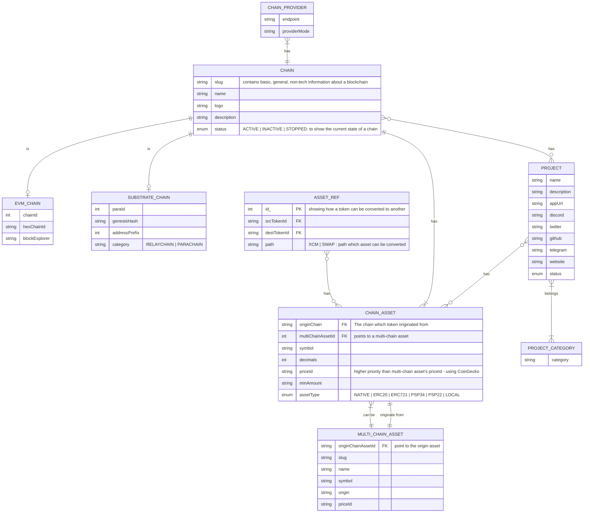

# SubWallet-Chain
**This is the repository to integrate, contain all information about projects/chains/assets available on SubWallet's products.**  

## Scope of this project
- Provide a coherent schema and interfaces for projects/chains/assets across blockchains
- Showing relationships between projects/chains/assets
- Track development status
- Provide metadata/on-chain information about chains and assets
- Provide general, non-tech information (website, description, social media,...) about chains and assets
- Allowing partners/teams to easily integrate with SubWallet products

## Schema

**Note: The current interfaces and json files do not necessarily follow this exact schema. The schema demonstrates the abstraction and relationships of the data**

### Explanation
- **Chain**: A blockchain, can be Polkadot, Kusama, Ethereum,...
- **EVM_Chain, SUBSTRATE_CHAIN**: blockchain type, contains technical information about a blockchain, a blockchain can be a mix between many types
- **Chain asset**: a token, NFT collection,... that originates from a blockchain
- **Multichain asset**: a high-level abstraction representation of an asset across many blockchains, it might have an on-chain origin or not
- **Asset reference**: showing path in which an asset can be converted to another
- **Project**: products for end-user building upon a blockchain, can be a dApp, a media team,...

**Please refer to [this guide](https://github.com/Koniverse/SubWallet-ChainList/wiki/Start-contributing-to-the-project) to start contributing to the project**
